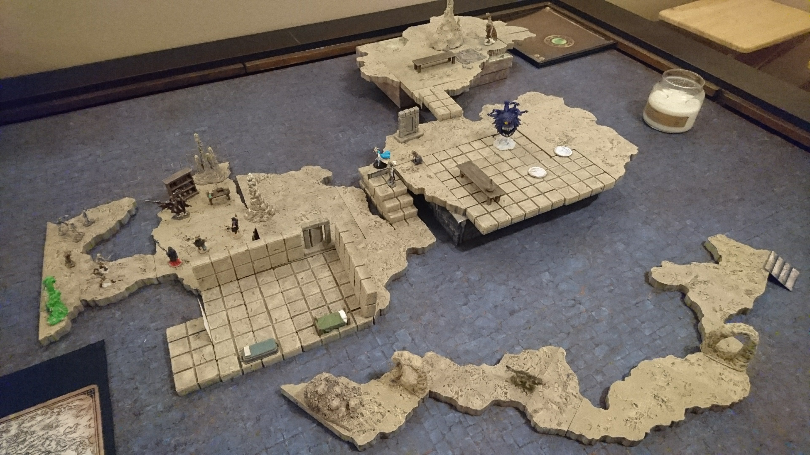
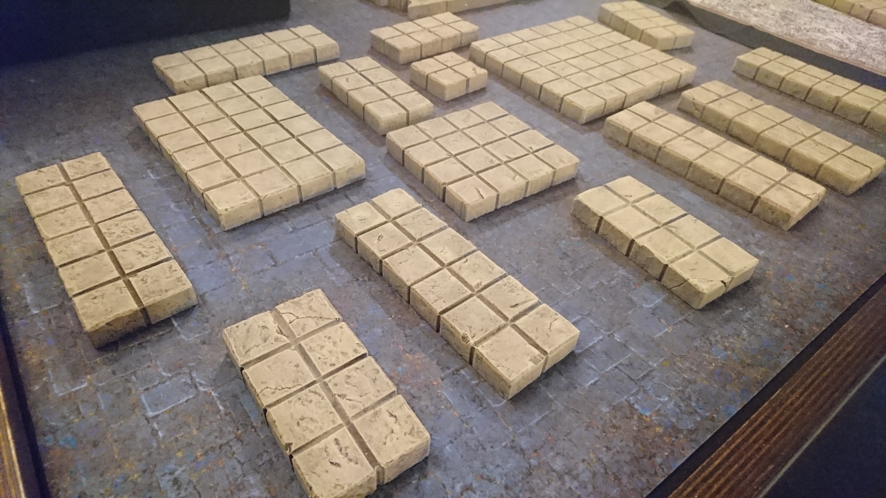
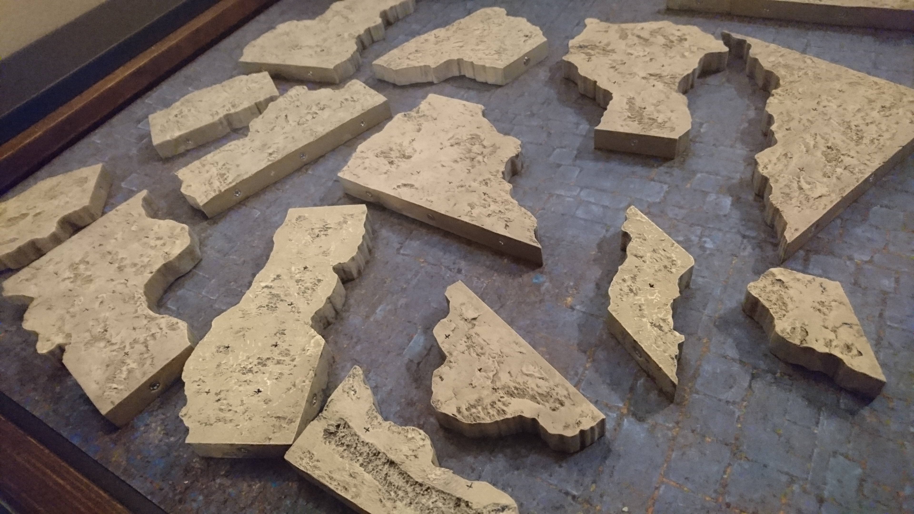
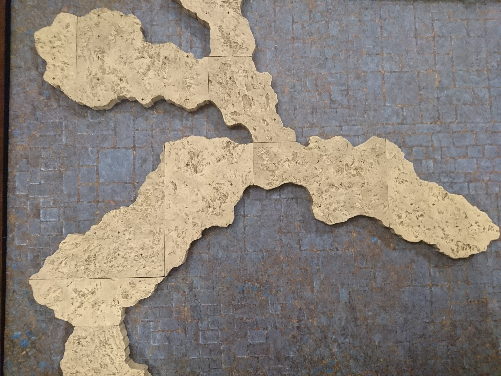
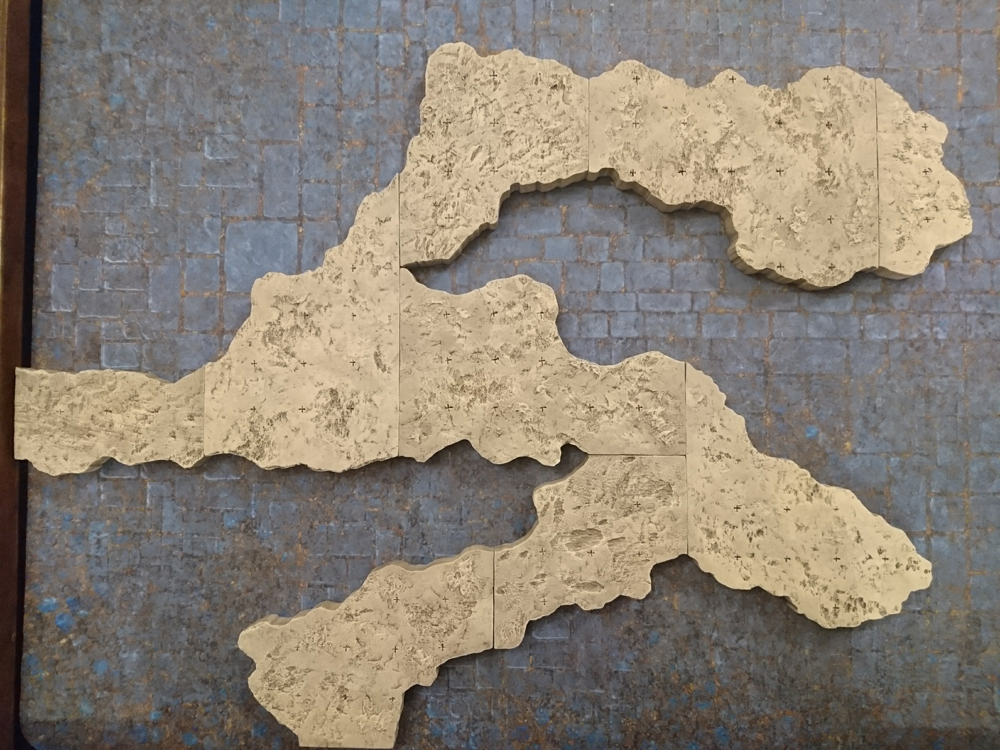
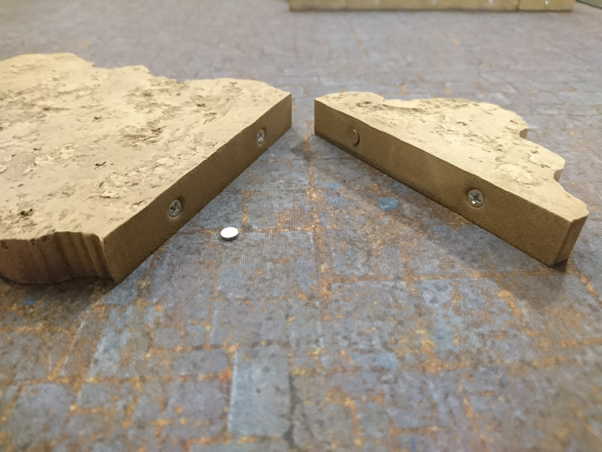
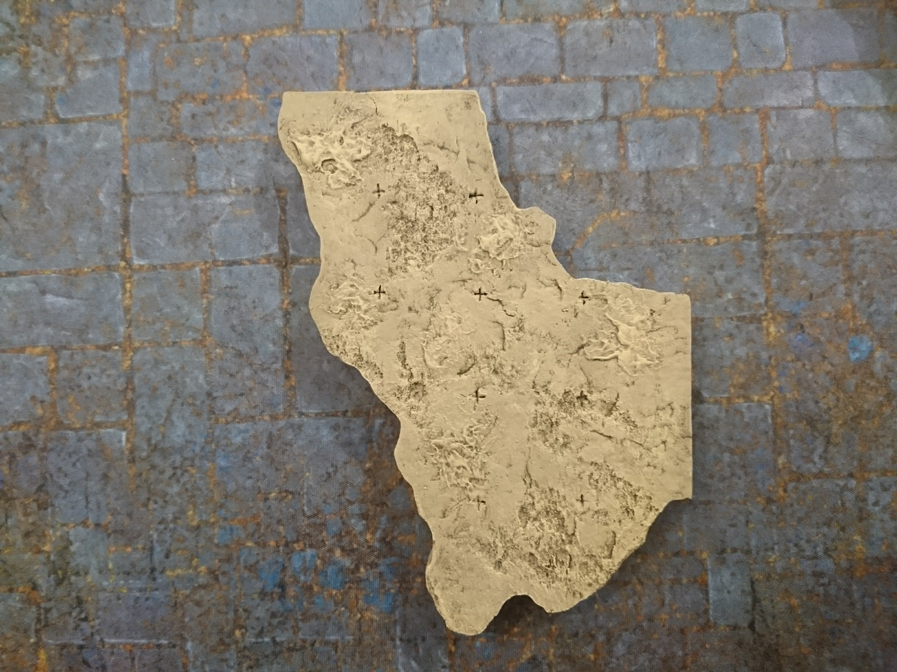

For the final dungeon of our first D&D campaign, which lasted a little over a year.

This dungeon was meant to be natural caverns with some parts carved and constructed into rooms and passages, so our block-shaped tiles are painted to match the color of the natural stone tiles.

Obviously reusability was a priority, but we didn't want to spend too much time on trying to maximize it. It saved us a lot of time to come up with a basic system for modularity, and then just make the pieces to match this specific dungeon.

We started out with the vague intention of creating pieces for the entire thing, to scale and everything. But near the end (after months of pumping out tiles) we fell victim to time constraints, barely having enough time between games to make the tiles we needed for the next session. So we started reusing the tiles we'd already made everywhere we could. It worked out pretty well because the whole dungeon was too big to fit on the 6x4-foot table anyway.

For modularity, the inside connecting edges of the pieces are 2, 4, or 6 inches long.

They can connect to other pieces of the same edge size, like above, or you can mix and match, like below.

Each piece has a small screw every two inches along the edges for connecting magnetically. We use 5mm x 1mm magnets in between the screws; this way, we don't have to worry about polarity.

We haven't found a good magnet solution for the square block tiles, because there are no definitive inside edges, so there would always be screws showing around the outside.

To keep track of distance, we added markers around every square inch, trying to keep them fairly subtle.

Ideally, if you're trying to make a matching set, you should make all the pieces in one go. This wasn't possible for us, and we made them in batches. For the blocky tiles, there was relatively little going on in the way of texturing, so they all came out pretty similar. But on the cave ground tiles, the texturing technique, among other things, was incredibly difficult to replicate in later batches.

These tiles are from different points along the several-months-long journey. The top left one is the very first. He was the prototype, where we tried out all our new ideas and mixed our different colors just the way we wanted. This was probably the biggest mistake of the whole project. When it came time to make all the rest of the tiles in exactly the same way, it was pretty much impossible. The texturing came out totally different, and for some reason, I did not have the presence of mind to write down the colors and amounts of the paints I mixed for the first tile. It took a very long time to get close enough to the original mystery color, and then over time we realized that the way it came out was totally dependent on the underlying colors in each coat, and the thickness of each layer, and seemingly endless other things.

In later batches, after much failing and redoing, we vowed never to use custom-mixed paints again, and settled on a new set of colors that was clearly different from the previous tiles, but close enough.

As luck would have it, Michael's was the only store to carry our main base color of light taupe, and of all the colors they could have decided to randomly quit stocking, that was the one they had to pick. No other brand had another color that was similar enough, so it was back to mixing and matching. I did end up coming up with a recipe that was pretty darn close, and it worked out fairly well for the rest of the tiles.

Still, in the end there is a lot of color and texture variation. It's probably less obvious to everyone else, since all I can see are the imperfections, and they're definitely adequate for the table.

The grand total number of pieces made for this set is 124; 64 irregular cave tiles, and 60 square block tiles.

Of the cave tiles, 6 were modified to have water running through them, and of the block tiles, 13 were painted in a more common grey (because we were nearing the end and thinking about the future, in which the dungeons we'll be in probably won't be carved out of a brownish cave).
