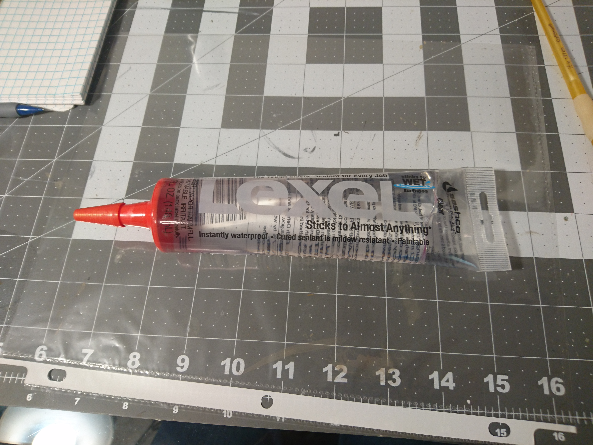
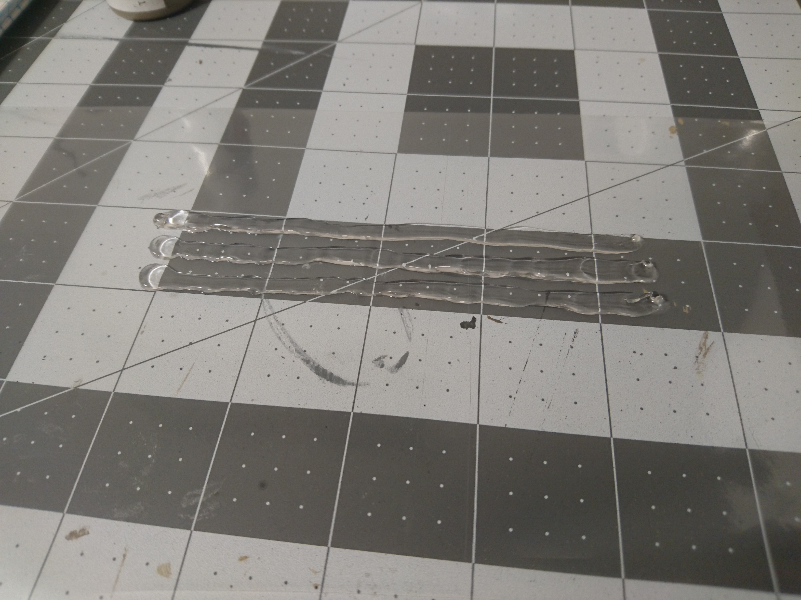
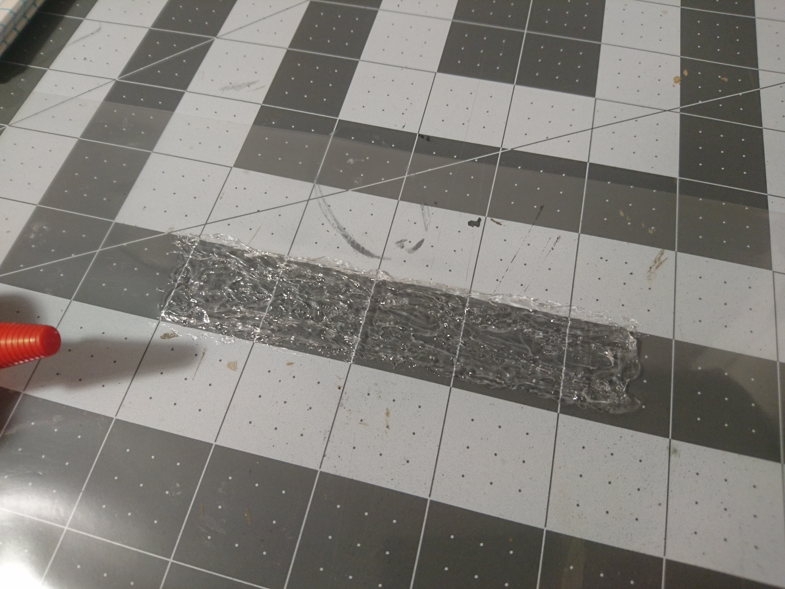
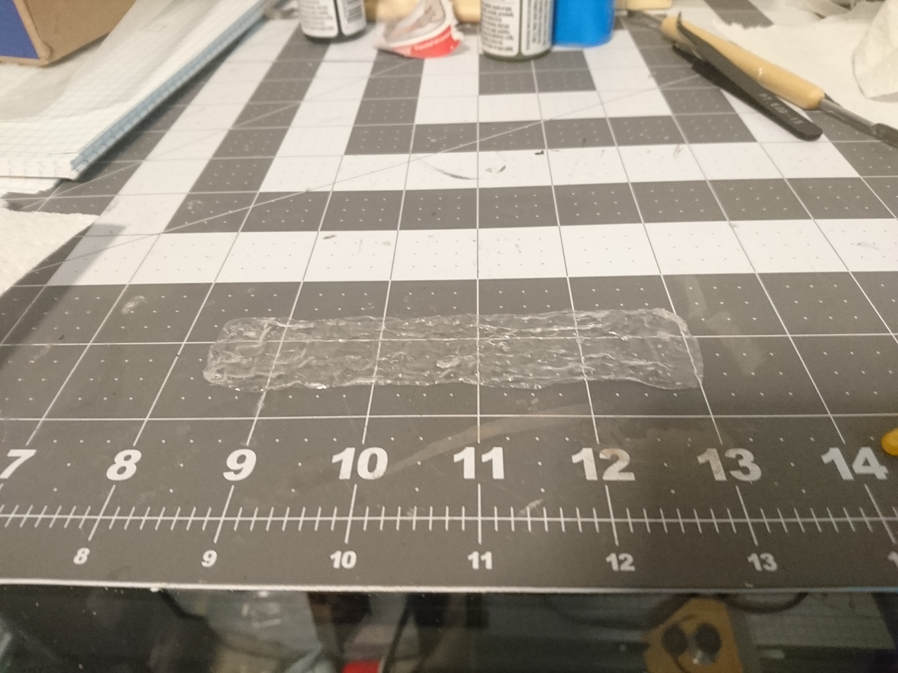
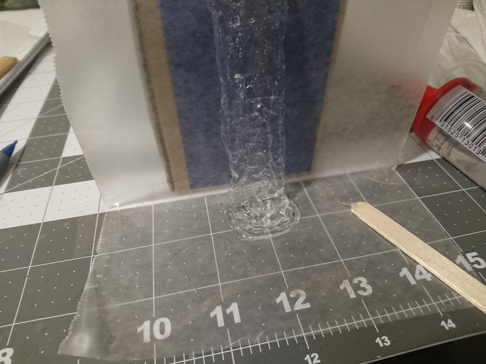
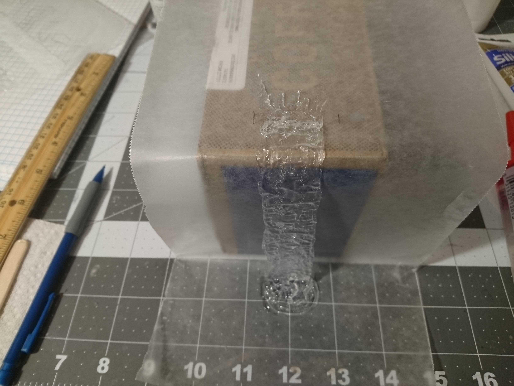
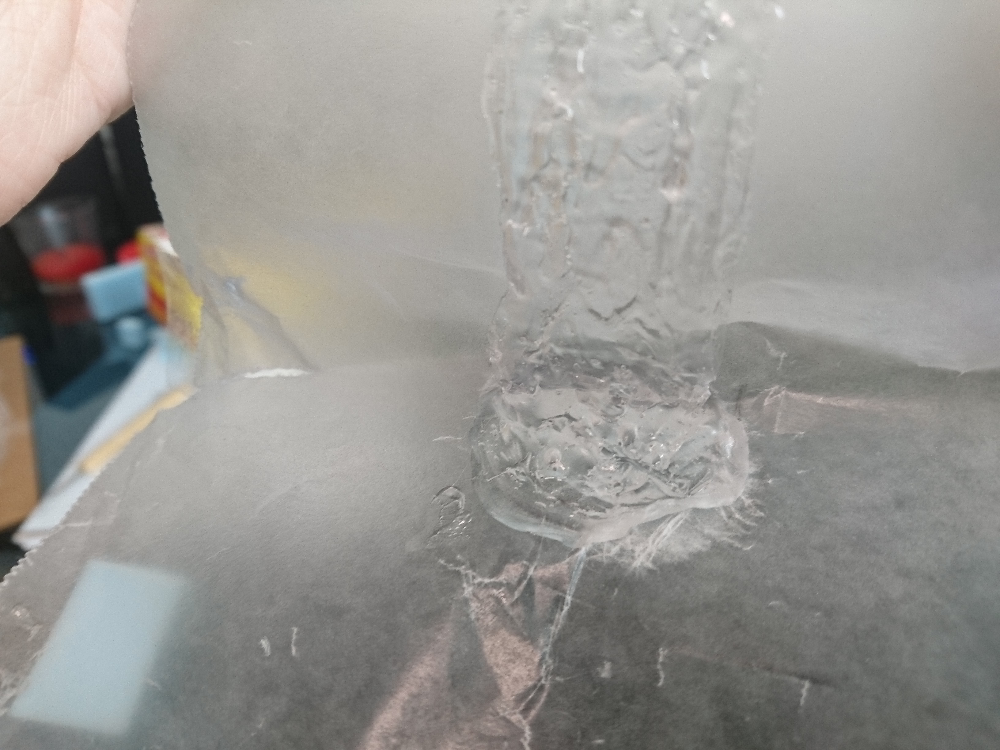
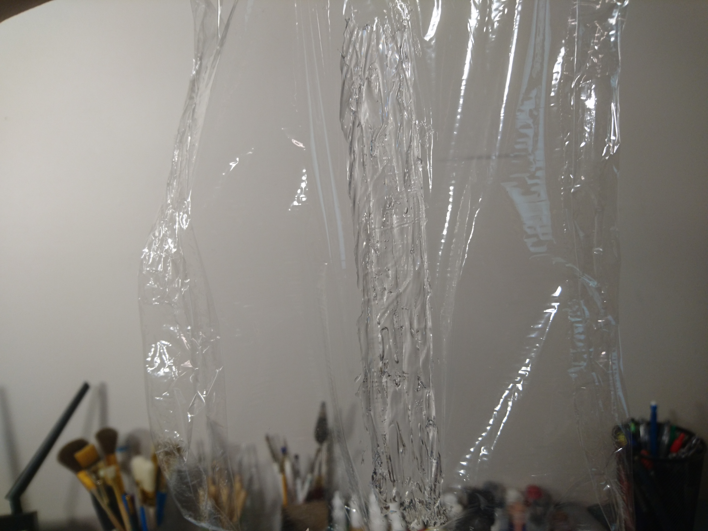

Usually these are made with actual water effects, or some kind of gloss gel medium, but I didn't want to spend the extra money so I decided to try out clear caulk.

This was right next to the caulk, but I don't believe it is caulk. It was crystal clear, so I decided to take the risk.

I squirted some strips onto a plastic sheet protector with the intent of peeling it off after it dried.

Then I spread it around with a gloved wet finger.

Once it was fairly dry, I tried to peel it off the plastic. It was at this point that I realized this stuff is definitely not caulk, and is specially made to bond.

Basically there was no getting it off that plastic without ruining it, so I just cut the plastic around it.

There's a few wrinkles on the back there, but it still looks alright.

I set up a little cardboard-and-wax-paper rig for setting up the structure. I hoped the sealant wouldn't stick to wax paper as much as the plastic. (Spoiler alert: I was wrong.)

I squirted more sealant around the bottom of the waterfall, piling it up high in the middle.

Then at the top I added more sealant to make these kind of streamlines that will transition the river to the waterfall.

After everything was dry, I tried to peel it all away.

And it stuck to the wax paper nearly as badly as the plastic.

(Picture of the bottom completely off the paper)

I got it off eventually, but all the stretching really deformed it and made it all foggy and white.

So I thought, Ok, I just need actual caulk and not super strong glue.

(Picture of silicone caulk)

So I got some clear silicone caulk, and spread out another waterfall on wax paper.

As you can see this clear caulk is not clear.

(Picture of white waterfall off the paper)

So next I figured I was stuck with the actually clear sealant, and this time I was gonna try it on plastic wrap, which is more crystally clear than a cheap sheet protector and would be a little more invisible after I cut the waterfall out.

Still got some wrinkles.

The very first waterfall was actually pretty okay, but the top and bottom were kind of ruined so I'm sticking with this plastic wrap one.
