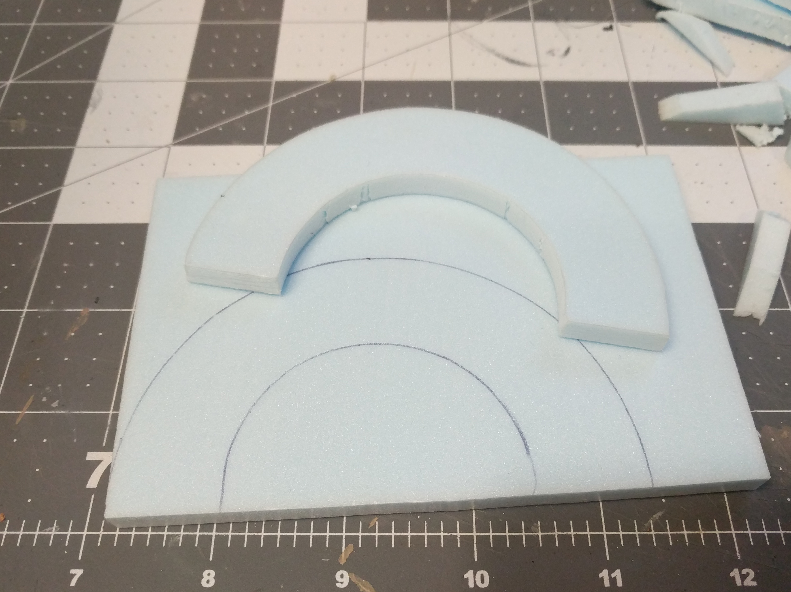
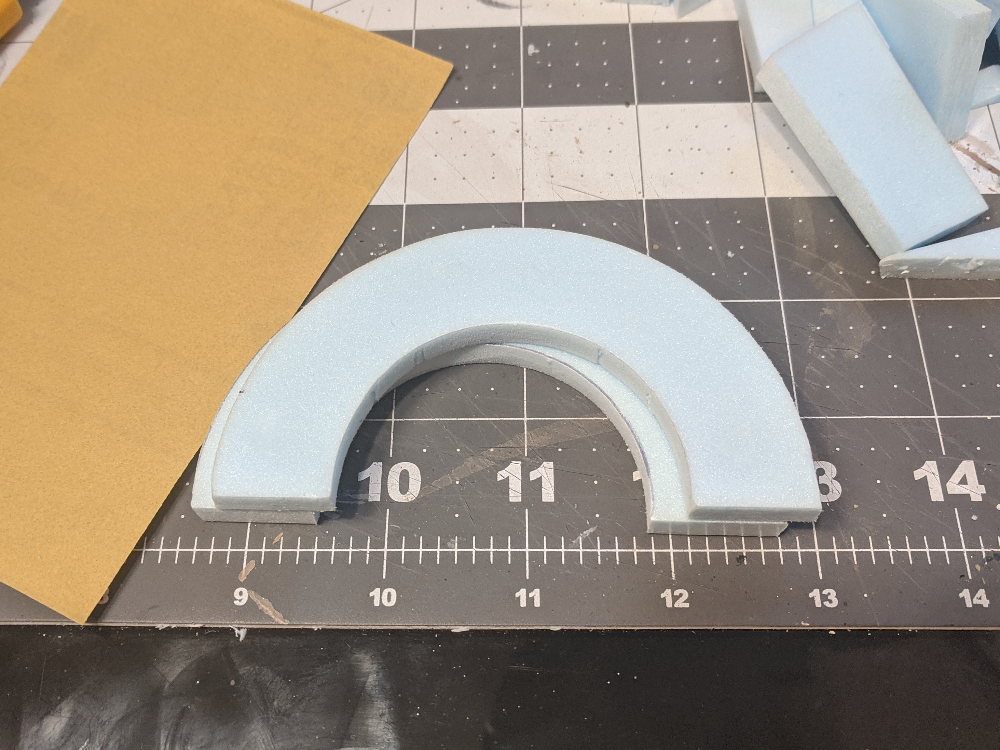
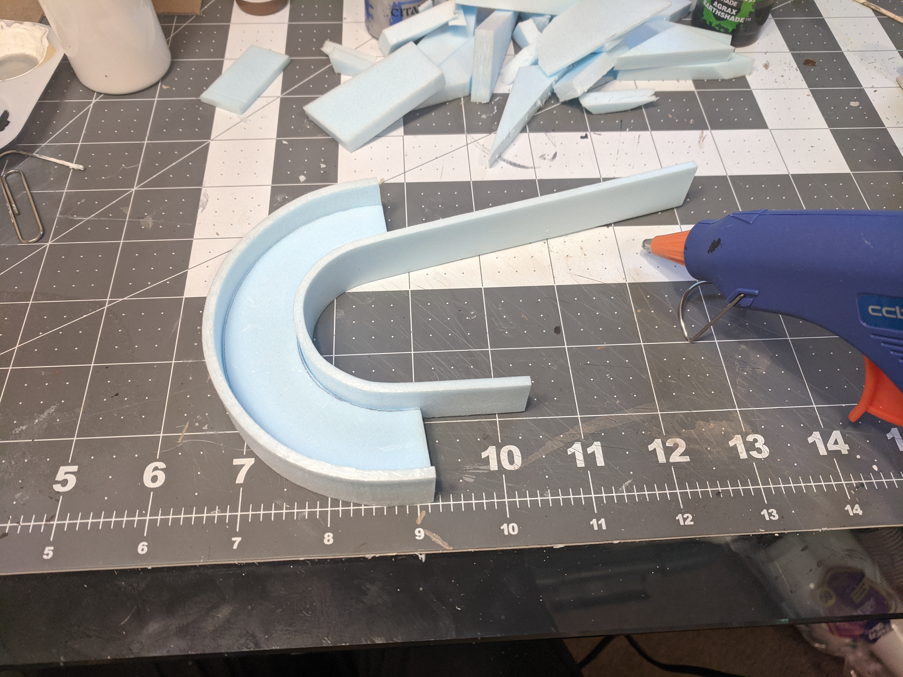
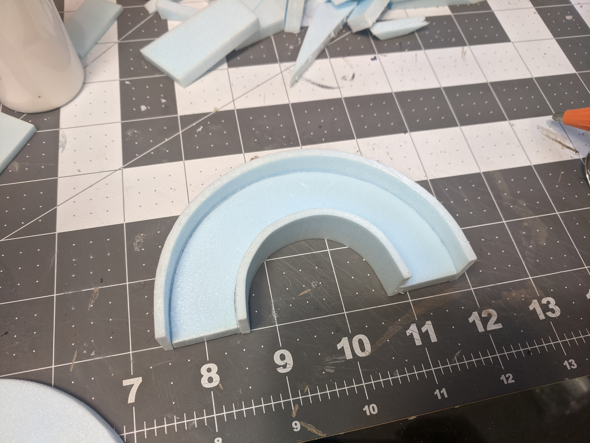
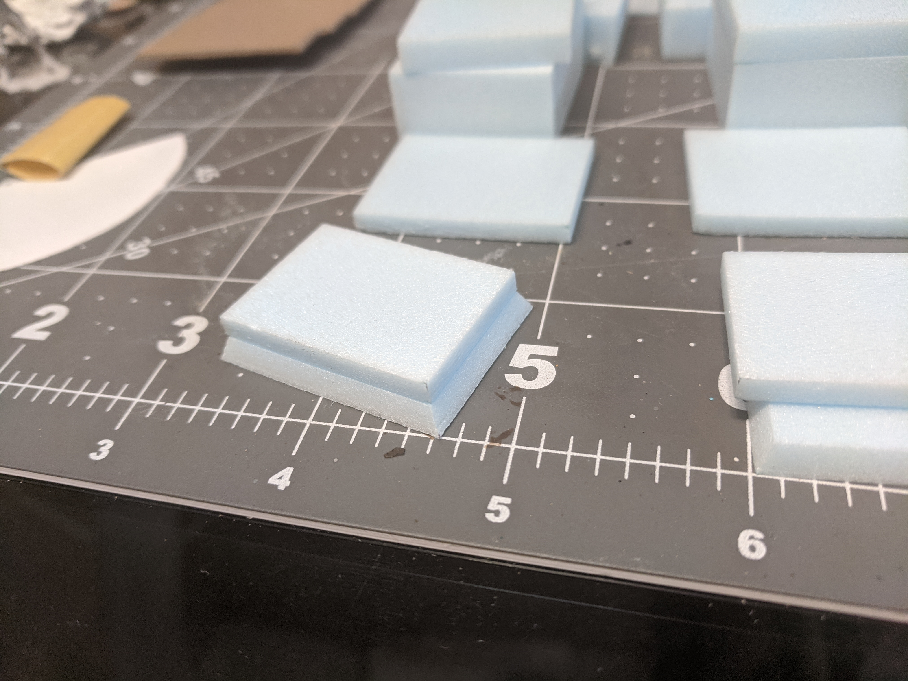

Time for a bigger project. I've been really focused on modularity and small reusable pieces, pretty much since I've started making terrain, and I've had a growing itch to make something big and fancy.

So Jimmy, the resident DM, had an idea for his upcoming D&D one shot, and this 3D model is closest to what he had in mind.

But instead of the Nordic-like designs and runes, we'd make it demonic themed, to fit with the story of the ancient demons' caverns hidden beneath the cathedral that the corrupt church used for their nefarious purposes.

And there's no way we're going to build something as big as this and only use it once, so we decided we'd make the 'theme' of it changeable. We'll do this by making the front parts of the arch and the pillars on each side removable.

It will make more sense as we actually get into it, so let's get into it.

Let's start with the arch on top. This piece of foam is about (something something measurement thick, which I have yet to obtain.) And for the first time ever, I used my compass for its intended purpose.

Unfortunately I couldn't use the hot wire table to cut it out, since freehanding it would have been a disaster for sure, and I would have needed to make some kind of jig. So I went at it with straight edge cuts with a utility knife. As I'd find out later, it would have worked much better to just slice along the curve in one smooth cut. For some reason I thought I couldn't do it that way.

Doing the inside was way more annoying.

I had to do an awful lot of sanding to smooth it out.

The problem with this much sanding was that I didn't keep to the lines very well on the front, and I had no lines at all on the back, so my perfectly round curve got all messed up.

I cut out a little template to stick onto it to try and get my edges back on track. Back to sanding.

Once I got the shape mostly accurate I traced around it onto another piece of foam, and repeated the whole cutting out process. We're making two of these to sit one in front of the other; the front piece will be the removable piece, and the back piece will sort of hold everything together.

The big old nicks on the edges shouldn't matter, because they won't be showing.

Now we'll glue some wide strips of foam to the sides of the back arch piece, to make kind of a frame for the front arch piece to sit in.

The measurements of the width of the strips and the thickness of each arch are important here because the arch in front needs to line up with the rims a certain amount, not quite flush.

Definitely had to use hot glue here; I needed it to dry as fast as possible, because I had no way to clamp it in place while waiting for it to dry.

I trimmed the excess off the ends and repeated with the inside of the arch.

And then trimmed off the excess again.

Testing out the fit of the other arch. I don't think we'll attach the removable arch in any way, (like magnets or something) because it seems to be a tight enough fit just sitting there.

So now that we have the top of the archway, we can start building our way down the pillars.

Here are the first couple blocks, nothing glued yet. I mostly eyeballed all the sizes.

Next is the largest central section of the pillars. The fronts of these will be removable, so I sliced about a quarter inch off.

More blocks added to the bottom, still no gluing.

It's a good idea to number these pieces while you're moving things around, so you can keep track of what goes where.

To add a little bevel to the blocks at the bottom, I cut them at an angle on the hot wire table.

I admit that I spent a whole morning cutting the two angled pieces (one for each side). It's extremely tricky to match a particular length and width when you make the cuts at an angle.

So finally here are all the blocks, top to bottom.

The bulky blocks at the bases of the arch won't be removable so they won't have the themed demonic carvings on them, but they'd be too bare as they are. I picked out a design that looks somewhat generic to carve into them. And since I didn't trust myself freehanding it, I made a paper template for it. Couldn't think of any way to transfer the pattern onto the foam, so I lay the paper on top of the foam and poked tiny pinholes through to mark the corners.

I connected the dots with a blunt pencil (blunt to give a decent width to the lines).

The pinholes weren't a great idea, I should've realized they wouldn't just disappear.

I made a similar pattern on the sides of these, the side that will be on the inside of arch. We won't need any on the back or the outside, because those will be covered with rocks later on.

Now for the removable pieces. These will be held in place with magnets.

On each front and back piece, I drew lines from corner to corner to find the exact center, then took one of my magnets (a small 1mmx5mm round) and pressed it down at the intersection to mark where it will go.

Then I carved out the circle with an exacto knife, trying to match the depth of the magnet.

I glued the magnets in with regular white glue, and then started on designing the removable faces.

An image search for 'demonic runes' turned up a whole lot of Doom pictures, so I grabbed one of those. Again, I didn't want to freehand it, so I printed a couple of them out at the proper scale and traced through them onto the foam with my trusty compass tip. (Didn't think the pinholes would work for this one.)

The lines were pretty faint, so I went over them and made them deeper with a ballpoint pen.

I textured the front as well as the left and right sides of the symbol pieces with rocks and tin foil, same way that I did all the texturing for our dungeon tiles. I did the same for the visible parts of all the rest of the blocks.

Now it's time to assemble. I used tacky glue, and hoped that was the right decision.

As we come to the central modular blocks, we obviously only want to glue the back part to the base, so the front part can still come off. We need the front attached for the moment at least so we can center it on top of the block below.

(This is the bottom)

For the front piece of the arch, I wanted to split it into 7 'blocks'. I traced around the arch onto some paper, and then used a protractor to mark the angles and draw the lines between them. Then I laid the arch back onto the paper and transfered the marks onto the edges of the foam.

The problem with this was, because I failed to make the arch a perfect half circle, the precisely measured angles didn't match up that well. Some of the lines were really slanted and the top and bottom edges of each block were different lengths, so I had to flip the piece over and try again on the back. I marked the exact spots on the arch again, but as I went I sort of freehanded it and tried to adjust the lines to look a little more even.

Moving over to the back piece of the arch, I laid the now-outlined removable arch into the frame and marked the 'rims' in the same places. I continued the lines all the way to the back on the sides that are going to be exposed.

I used tin foil to do the texturing. I skipped the giant rocks on this piece, it's a little too fragile to beat up.

Here are the runes drawn in. These are characters from D&D's Infernal script. I just picked out random ones that looked cool. I used my blunt pencil to do most of it, then used the sharper compass tip to do the thinner parts and ends of the lines.

I had to go over it a few times to get a good depth.

Tin foil and rocks for the texturing.

Now ready to glue the final pieces together.

I didn't even realize, even with how much I fretted over getting everything just right, that I put the patterned blocks on the wrong sides. Now the carved sides that are supposed to be on the inside of the arch are on the outside.

