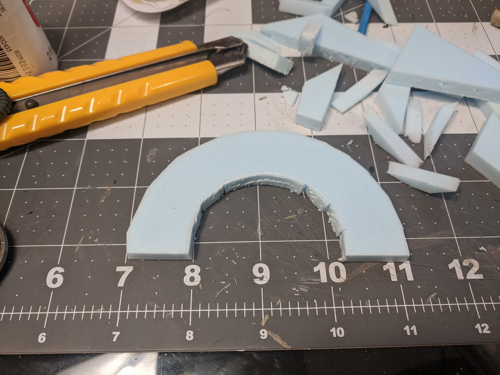
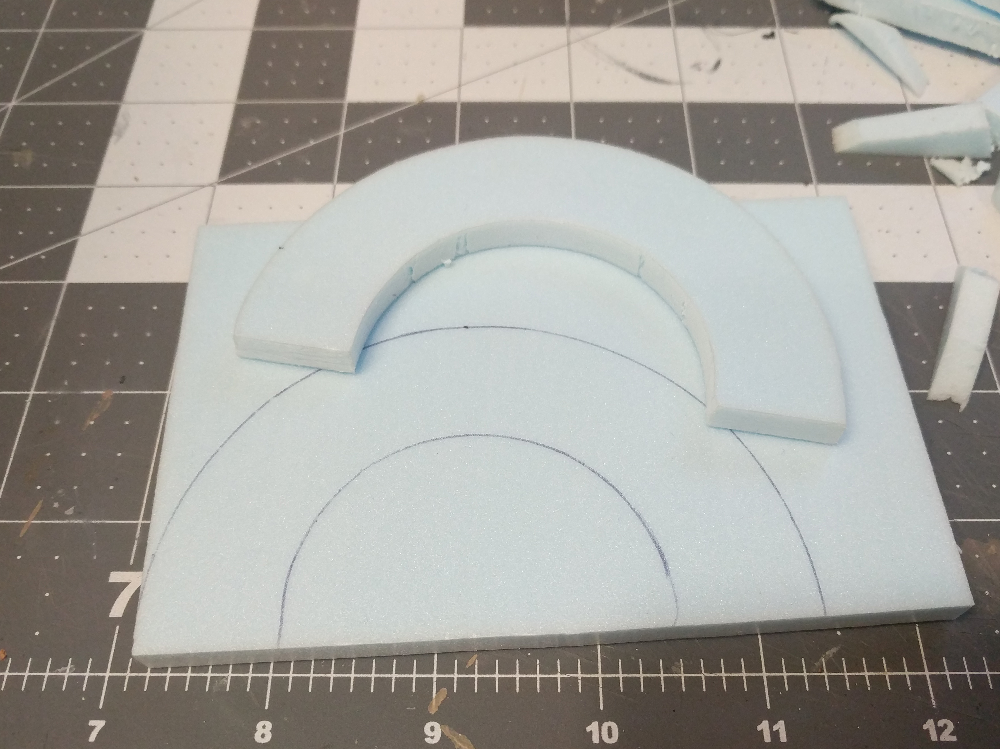
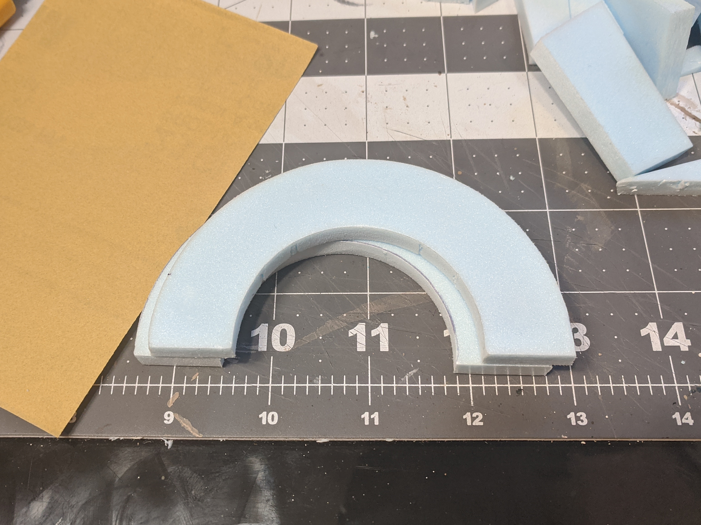
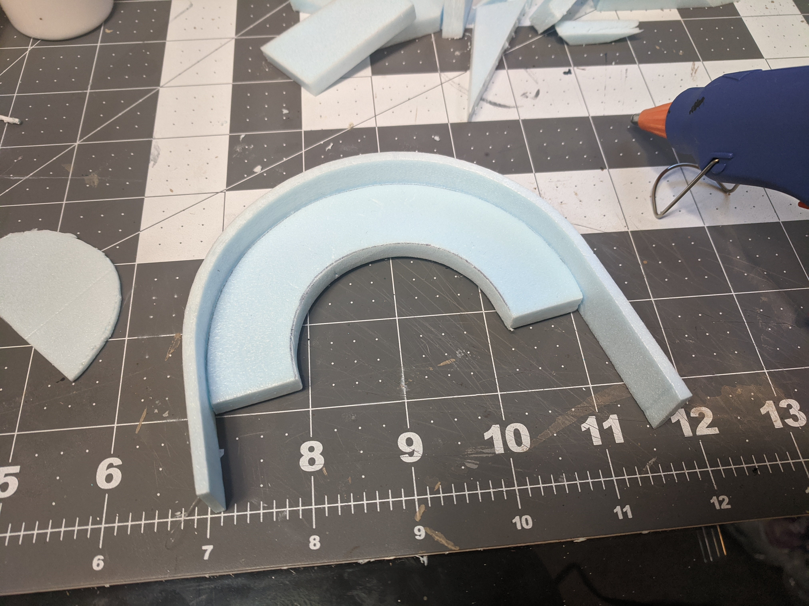
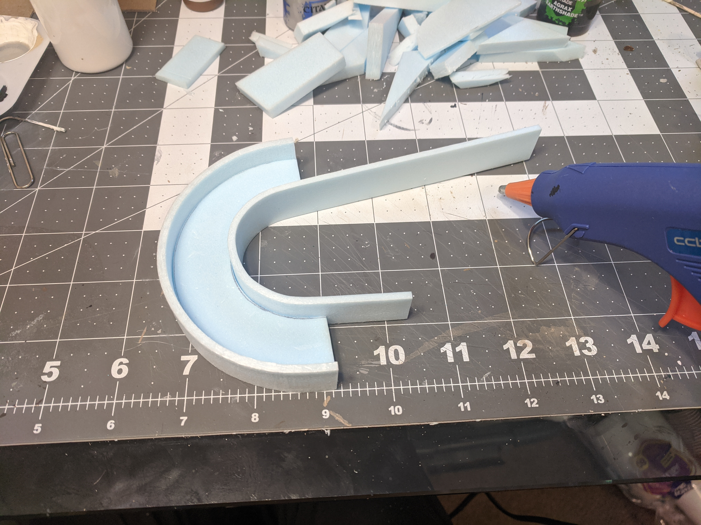
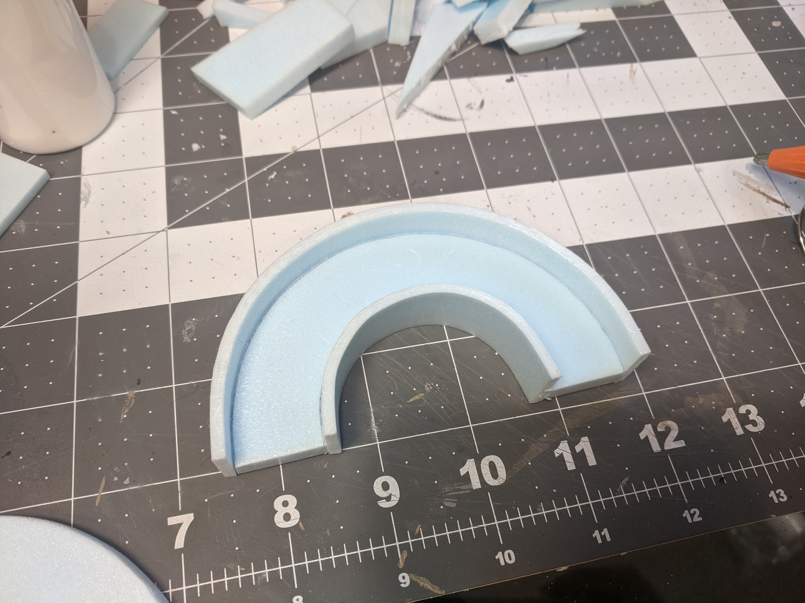
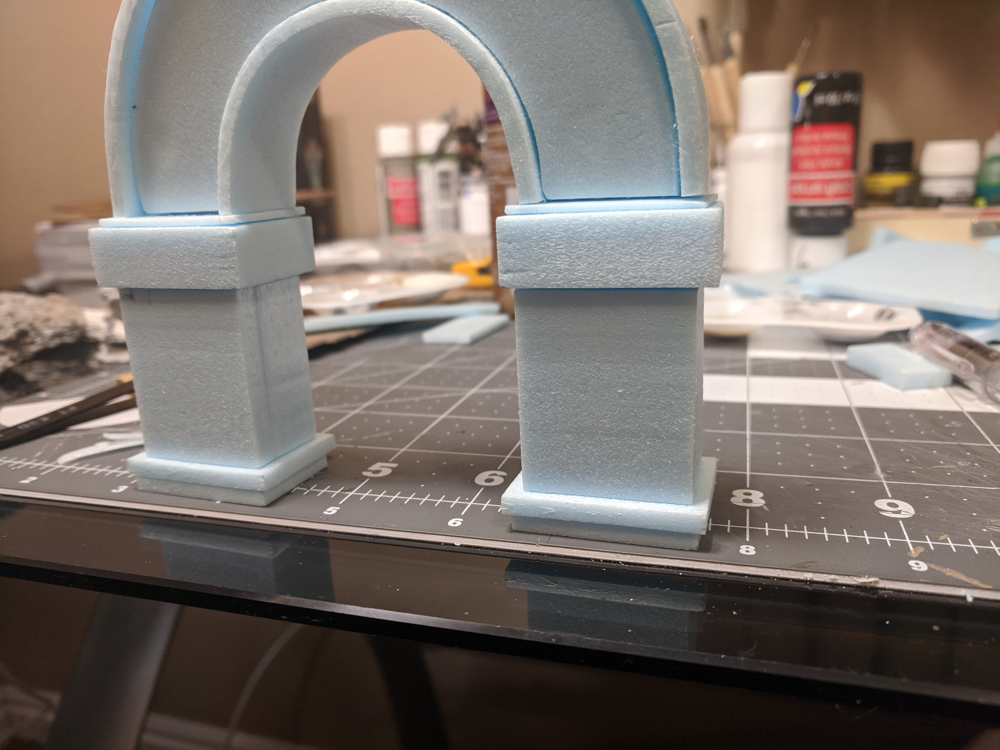
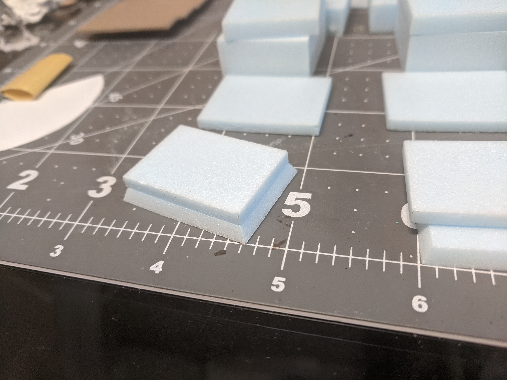

Used my compass for its actual purpose 

Started slicing off straight-edged chunks with a knife. Freehanding on the hot wire table would have been a disaster for sure, I would have needed some kind of jig or something.

Doing the inside was way more annoying.

Had to do an awful lot of sanding.

The problem with this much sanding was that I didn't keep to the lines very well on the front, and I had no lines at all on the back, so my perfectly round curve got all messed up.

I cut out a little template to stick onto it to try and get my edges back on track.

Once I got the shape mostly accurate I traced around it onto another piece of foam, and repeated the whole cutting out process.

Now to create the sides, or rims, can't think of a good word here, I'll glue some long strips onto the edges of one of the arches.

The measurements of the width of the strips and the thickness of each arch are important here because the arch in front needs to line up with the rims a certain amount, not quite flush.

Definitely had to use hot glue here; I needed it to dry as fast as possible, because I had no way to clamp it in place while waiting for it to dry.

I trimmed the excess off the ends and repeated with the inside of the arch.

And then trimmed off the excess again.

Testing out the fit of the other arch.

The first blocks for the beginning of the arch pillars, no gluing yet.

The main part of the pillars. The fronts of these will be removable, so I sliced about a quarter inch off.

More blocks added to the bottom, still no gluing.

To add a little bevel to the blocks at the bottom, I cut a couple of the blocks at an angle on the hot wire table.

I admit that I spent a whole morning cutting these two pieces. It was impossible for me to cut the angles 