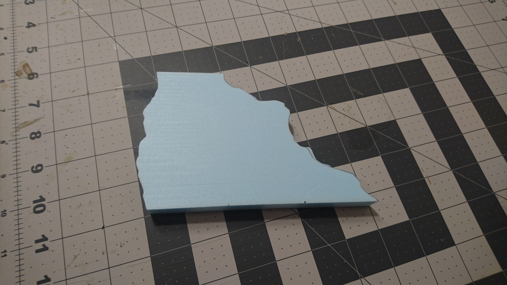

This is the piece we're starting with. It's 6 inches along the bottom and 2 inches on the top, to fit with our 2-4-6-inch modular set. The rough edges were cut freehand on the hot wire table.

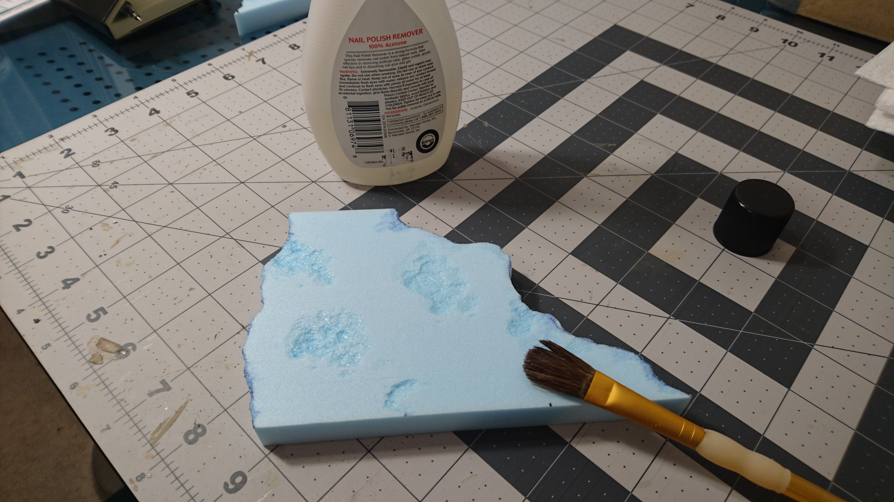

To start off the texturing, we brush on some nail polish remover to eat away at the surface.

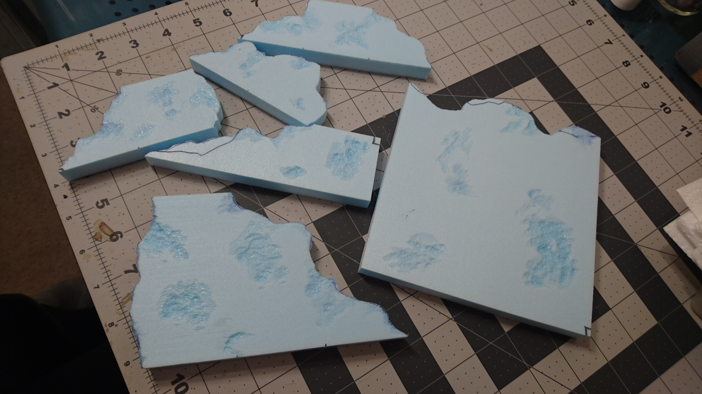

Here's the rest of this batch.

Next we go over the entire surface with a rough rock.

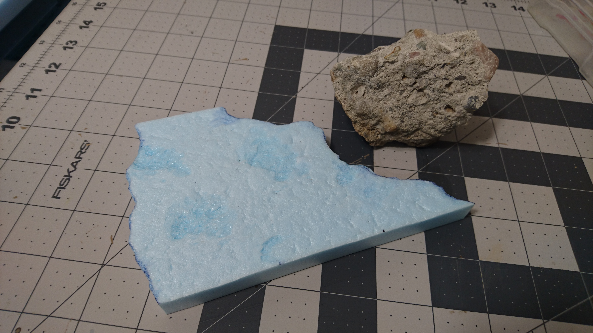

When you roll it over the foam you have to press pretty hard, since the foam will kind of spring back to its original form over time. You can also use a balled up piece of tin foil, which I sometimes do, but at this point I was preferring the look of the rock texture.

After brushing off the rock crumbs, we squirt some caulk onto some random spots and spread it around a little bit.

And then with a wet sponge, kind of dab it around and blend it in with the surrounding texture. You can achieve some different effects by varying how wet the sponge is. (More water will make a much smoother texture.)

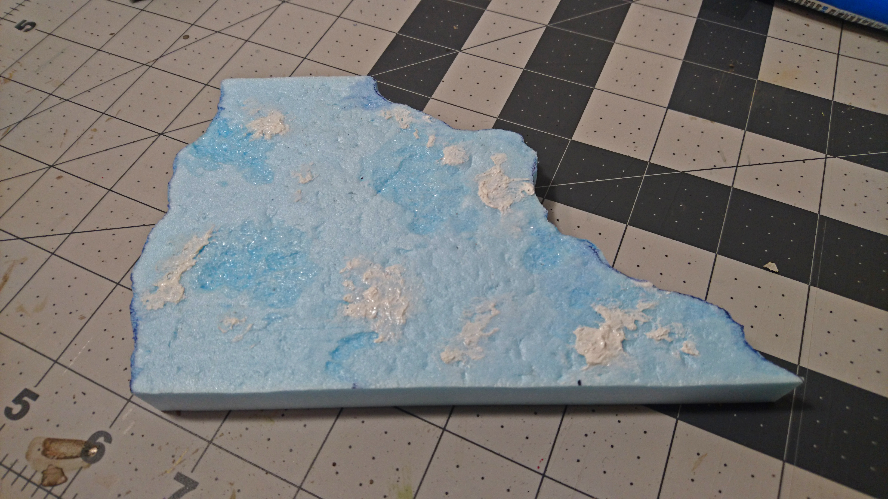

The finished texture.

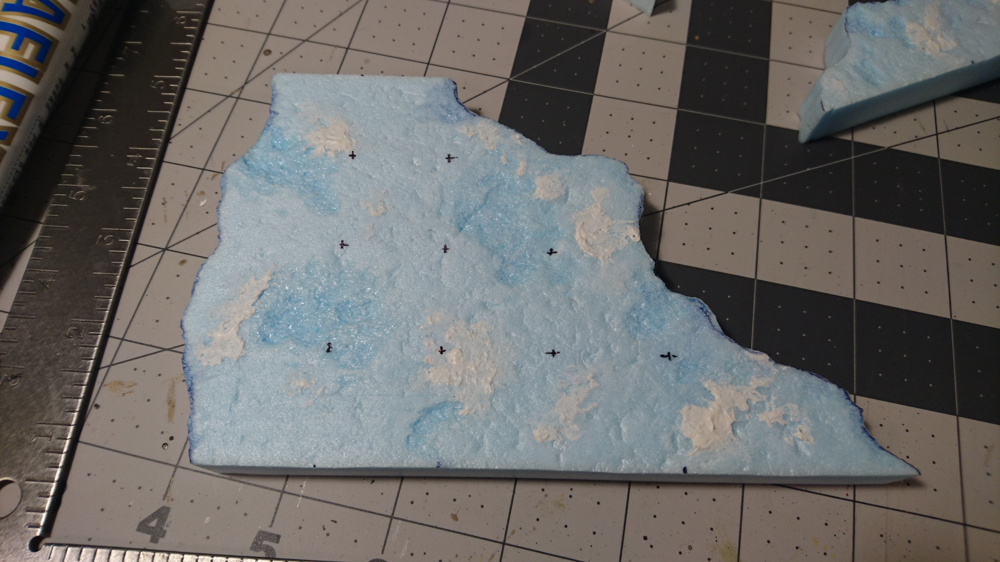

Here I've sharpied in the 1-inch grid marks that will be cut into the piece.

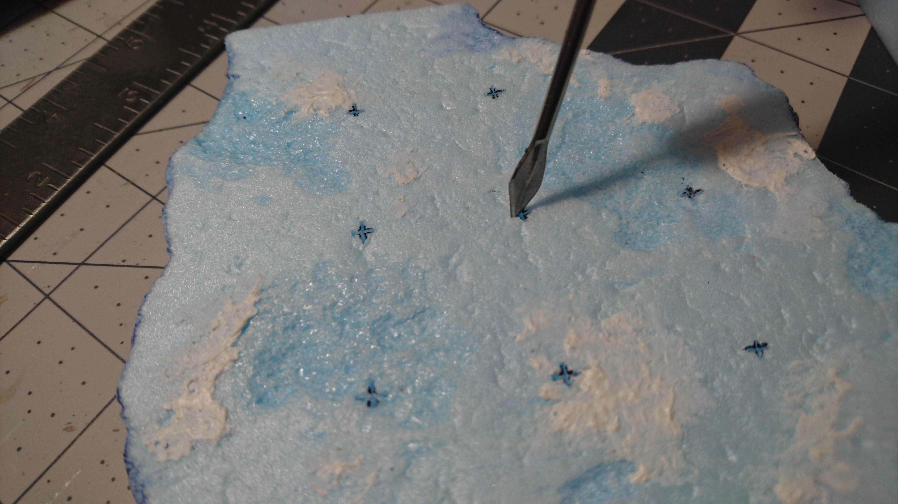

I used an exacto knife to make shallow cuts (maybe 1/16" deep) and then used a sculpting tool to widen them up.

After that it's time for painting.

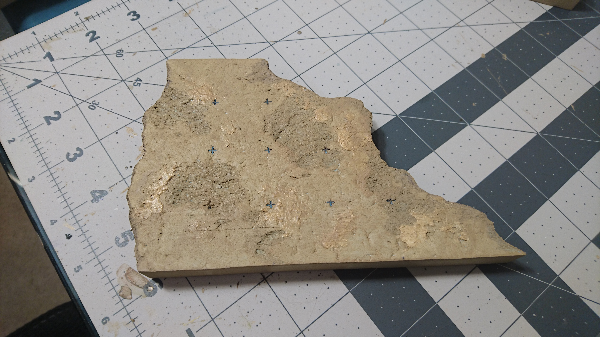

The base coat is our standard mix of mod podge and the base color, a light taupe. About a half and half mix, but the amounts don't really matter.

Once that's dry, we add a second coat of just paint.

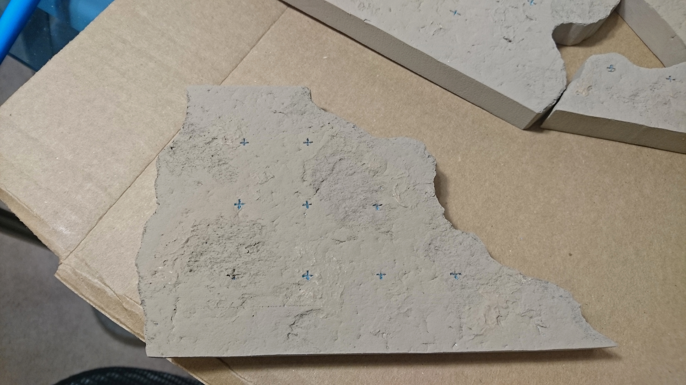

You don't really want to do any mod podge in this coat because it will become a little too slick to hold the wash, which is next.

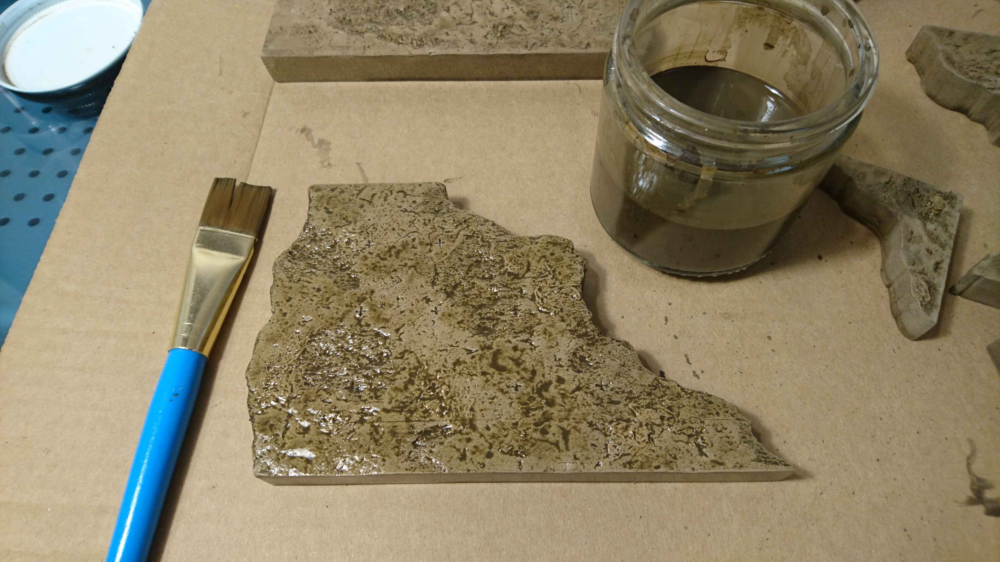

The wash is just some dark brown paint, a little bit of black paint, a bunch of water, and a drop of dish soap.

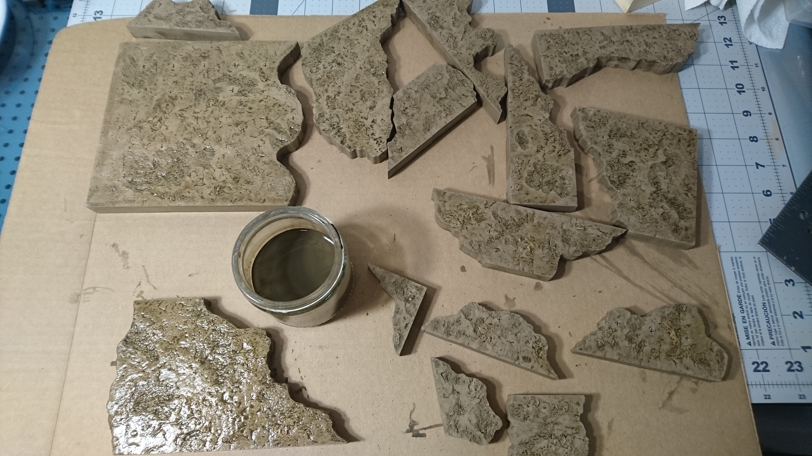

Here's the batch.

These take quite a while to dry completely. Next up is to use the main base color, our light taupe, to do a very heavy dry brush.

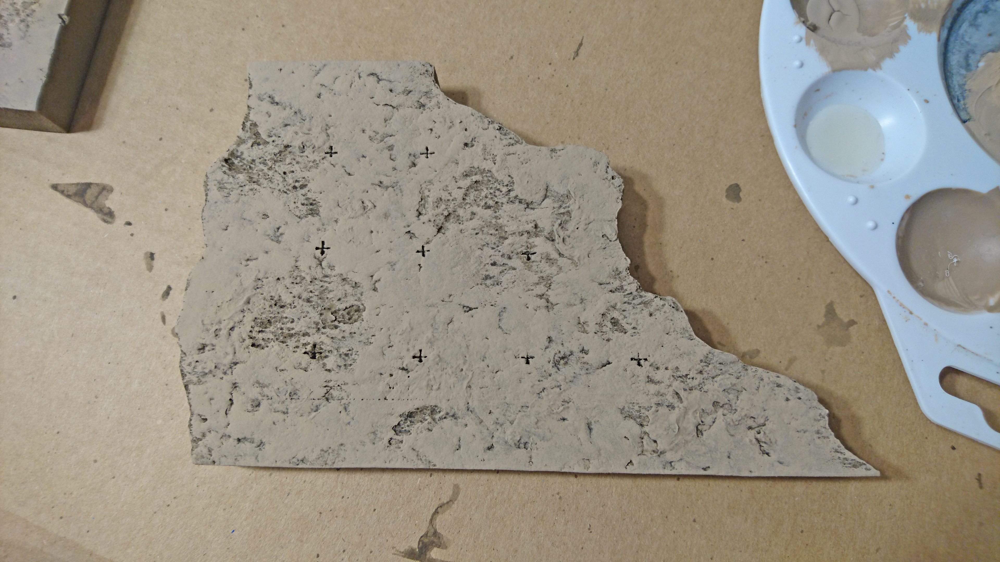

We're covering almost the whole thing here, in a pretty solid coat. There was probably a better way to achieve this effect with less painting overall, but we were trying to match our previous tiles, and there just wasn't enough time for experimentation.

The first round of highlights is done with a lighter brown, just dry brushed on more selectively.

The final highlights are done with a light brownish yellow, and brushed on even more sparingly.

And there's the finished tile. A good extra step would be to put on one or two coats of a matte or satin polyurethane spray, which I haven't gotten around to yet.
